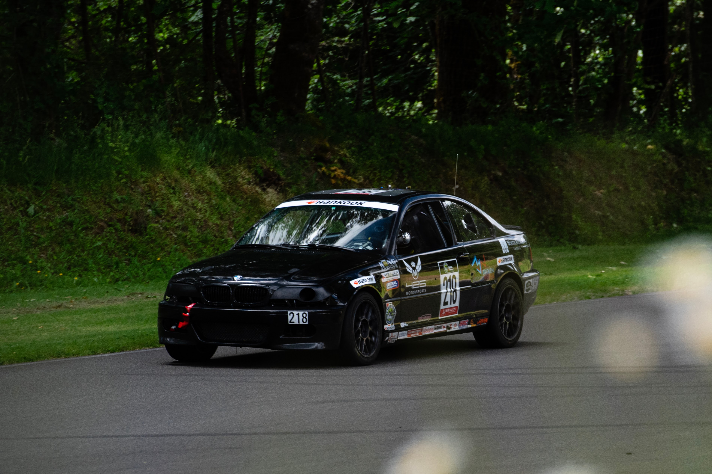

# Broken Motorwerks Telemetry

This project encompasses a real-time telemetry system for Broken MotorWerk's [LDRL](https://www.racelucky.com/) race car. It utilizes a Rust application running on an STM32 mcu to read CAN data from the car (lovingly referred to as Sabine) and other sensors. This data is then broadcast over an XBEE RF link.

Project documentation is accessible at <https://broken-motorwerks.github.io/docs/>.

